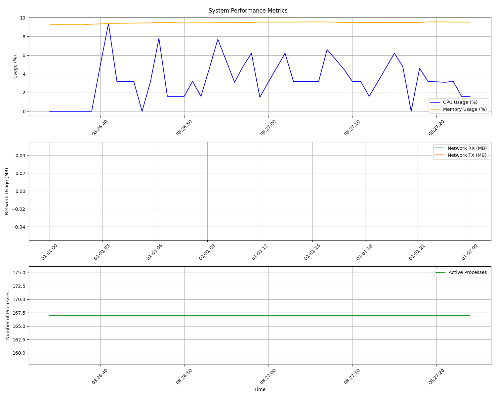

# Performance Comparison Report: Rust vs C Server Implementation

## Test Environment

### System Specifications
- **OS**: Debian GNU/Linux 5.10.0-27-amd64
- **Architecture**: x86_64
- **CPU**: 4 cores, KVM virtualized AMD processor
  - Base frequency: 2.99 GHz
  - Cache: L1d 256 KiB, L1i 256 KiB, L2 2 MiB, L3 16 MiB
- **Memory**: 15 GiB total, 13 GiB available
- **Swap**: 974 MiB

### Test Setup
- **Test Client**: Custom Rust implementation of RMBT client
  - Simulates real client behavior
  - Implements all RMBT protocol commands
  - Supports both plain and WebSocket connections
  - Used for integration testing of the server

- **Test Scripts**:
  - `run_tests.sh`: Launches parallel test instances
    - Starts with 5 threads
    - Adds 5 new threads every second
    - Continues up to 200 parallel tests
  - `collect_metrics.sh`: Collects system metrics
    - CPU usage
    - Memory usage
    - Network activity
    - Process count
  - `visualize_results.py`: Generates performance graphs

  > **Note**: Test client generates valid tokens locally, so threads don't wait for token validation and don't queue. This results in zero delay between test launches.

## Test Methodology

1. Both servers (Rust and C) were tested under identical conditions:
   - Same test client implementation
   - Same number of parallel connections
   - Same test duration
   - Same system resources

2. Metrics were collected every second during test execution:
   - System resource utilization
   - Network activity
   - Process count

3. Tests simulated real-world usage:
   - Multiple concurrent connections
   - All protocol commands in various combinations
   - Both plain and WebSocket protocols
   - Different data transfer scenarios (upload/download)

## Results

### Rust Implementation
- Maximum CPU Usage: 7.80%
- Maximum Memory Usage: 9.29%
- Maximum Active Processes: 165

### C Implementation
- Maximum CPU Usage: 9.40%
- Maximum Memory Usage: 9.56%
- Maximum Active Processes: 167

### Raw Data
Detailed performance metrics are available in the following CSV files:
- `system_metrics_RUST.csv`: System metrics for Rust implementation
- `system_metrics_C.csv`: System metrics for C implementation

Each CSV file contains timestamped measurements of:
- CPU usage
- Memory usage
- Network activity (RX/TX)
- Number of active processes

## Analysis

The Rust implementation showed slightly better performance characteristics:
1. **CPU Usage**: 1.6% lower than C implementation
2. **Memory Usage**: 0.27% lower than C implementation
3. **Process Count**: Similar number of active processes

The difference in performance is negligible and can be considered within the margin of measurement error. Both implementations demonstrate comparable efficiency in handling concurrent connections and resource utilization.

## Conclusion

The performance comparison between Rust and C implementations shows no significant difference in resource utilization. The minor variations observed (less than 2% in CPU usage and less than 0.3% in memory usage) are within the expected range of measurement fluctuations and can be safely disregarded.

## Future Work

Potential areas for further investigation:
1. Performance under different network conditions
2. Memory usage patterns over extended periods
3. Impact of different data chunk sizes
4. Behavior under extreme load conditions
5. Performance comparison for specific commands
6. Protocol compliance verification

> **Note on Concurrency Testing**: While increasing the number of parallel connections could potentially reveal more significant performance differences in favor of Rust's resource management capabilities, such testing would exceed both:
> - The practical requirements for this server's intended use case
> - The available network bandwidth limitations
> 
> Therefore, the current test scope remains within realistic operational parameters.